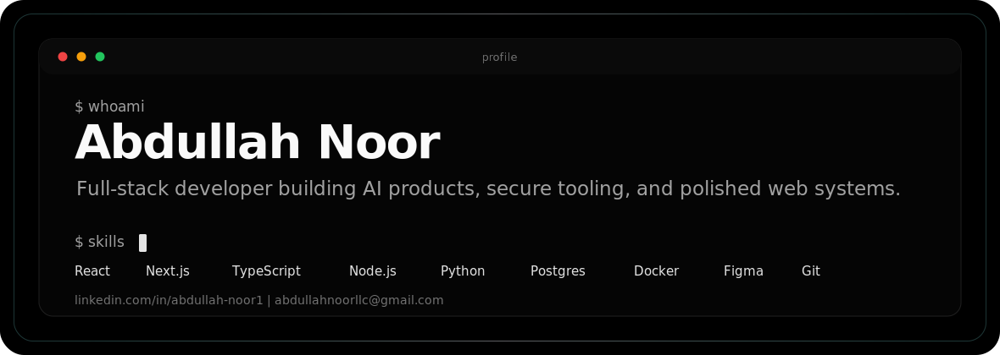

  

  

  
  
  

  
  
  

 

  
<h2>Featured Build</h2>

  <table>
    <tr>
      <td width="58%">
        <h3>STROKIX</h3>
        
<b>AI operating system for business teams.</b> Solo-built, live in production, and designed around secure tool access, agent workflows, and human approval.

        <ul>
          <li>Connects 33 workplace tools including Salesforce, Slack, GitHub, Jira, and HubSpot through OAuth 2.0.</li>
          <li>Uses AES-256-GCM tenant credential encryption, PostgreSQL row-level security, and approval gates for write actions.</li>
          <li>Ships persistent memory, PII redaction, semantic retrieval with pgvector, SSE streaming chat, Celery workers, and model routing.</li>
        </ul>
      </td>
      <td width="42%">
        

          
          
          
          
          
        

        

          
        

      </td>
    </tr>
  </table>

  
<h2>Top Projects</h2>

  <table>
    <tr>
      <td width="50%">
        <h3><a href="https://github.com/anoor3/phone-terminal">phone-terminal</a></h3>
        
Control a laptop terminal from a phone with signed messages, WebSockets, QR pairing, and a pty-backed CLI.

        

          
          
          
        

      </td>
      <td width="50%">
        <h3><a href="https://github.com/anoor3/VentureMind">VentureMind</a></h3>
        
Multi-agent RAG research system for structured investment analysis with planner, researcher, analyst, and writer agents.

        

          
          
          
        

      </td>
    </tr>
    <tr>
      <td width="50%">
        <h3><a href="https://github.com/anoor3/aiNotebook">aiNotebook</a></h3>
        
AI notebook app focused on structured thinking, saved context, and mobile-first product workflows.

        

          
          
        

      </td>
      <td width="50%">
        <h3><a href="https://github.com/anoor3/praxis">praxis</a></h3>
        
Experimental AI system for tool use, visual reasoning, and creative execution workflows.

        

          
          
        

      </td>
    </tr>
    <tr>
      <td width="50%">
        <h3><a href="https://github.com/anoor3/mindfold">mindfold</a></h3>
        
TypeScript project for folding multidimensional data into a cleaner, more navigable product experience.

        

          
          
        

      </td>
      <td width="50%">
        <h3><a href="https://github.com/anoor3/Attendly">Attendly</a></h3>
        
Smart attendance system for professors and students, built around practical classroom workflows.

        

          
          
        

      </td>
    </tr>
  </table>

  

    
  

  
<h2>Favorite Tools</h2>

  <h3>Languages</h3>
  

    
  

  <h3>Frontend</h3>
  

    
  

  <h3>Backend, Data, and Infrastructure</h3>
  

    
  

  <h3>AI and Security</h3>
  

    
    
    
    
    
    
    
    
  

  
<h2>Stats and Activity</h2>

  

    
  

  

    
    
  

  

    
  

  

    
  

